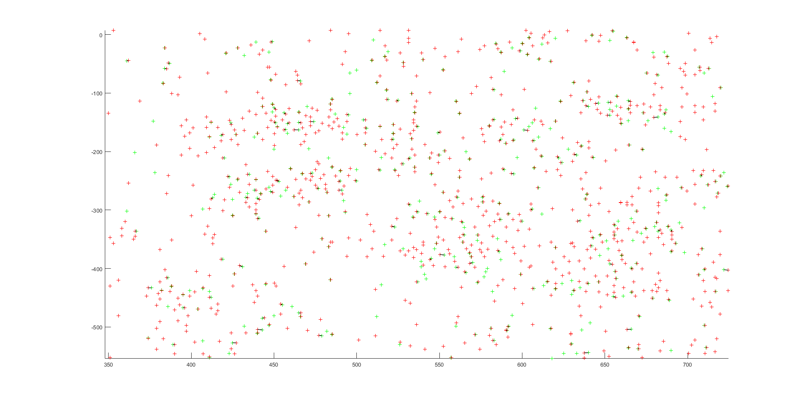
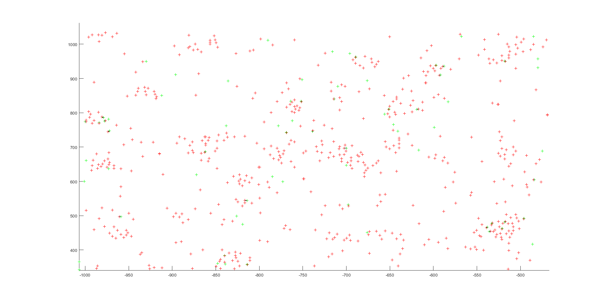

# Debugging
This document gives some tips to overcome some common problems in the various steps of the in situ sequencing pipeline.

## [extract_and_filter.m](https://github.com/jduffield65/iss/blob/7x7-No-Anchor/%40iss/extract_and_filter.m)

For each image corresponding to a particular imaging round, colour channel and tile, this step first applies focus stacking. It then filters the resultant 2D image and saves the result as tiffs. 

**Problem 1**

The only real problem that can be encountered in this step is to do with the filtering. At the moment, we do a top hat filtering with the intention of extracting spots from the background. Below atre some examples of this step with vaying size of filters (filters are disks of radius r pixels).

<p float="left">
 
<em> No Filter</em>

<em> r = 15</em>
</p>

<p float="left">
 
<em> r = 6 &nbsp;&nbsp;&nbsp;&nbsp;&nbsp;</em>

<em> r = 2</em>
</p>

From these images, it can be seen that the top two images don't fully extract the spots. There are a few places where the spots can't be distinguished too well from the background. The last image, with r = 2, removes too much information and the spots look deformed. So a comprimise with r=6 seems to be the best.

**Solution**

[The filter used to do the top hat filtering is](https://github.com/jduffield65/iss/blob/0f30eecc859066c9a9d365229a2686aa1cfd2808/%40iss/extract_and_filter.m#L50-L58):
```matlab
SE = strel('disk', o.ExtractR);
```
As default, ```o.ExtractR = 'auto'``` which means ```o.ExtractR = 1/pixelsize```. This usually works but if you see spots in the raw data which are not emphasized by the filtering, there is the option to manually set ```o.ExtractR```. It should be approximately the radius of the spots in the raw data. 

**Problem 2**

Another potential problem stems from the fact that the datatype of the saved filtered tiles is ```uint16``` (integers in the range 0 to 65535). So if there are a lot of values in the filtered images above 65,535 or equally well below (rounding to integers, loses details in decimal places) then there will be a significant loss of information. You may notice this in the [spot detection step](https://github.com/jduffield65/iss/blob/0f30eecc859066c9a9d365229a2686aa1cfd2808/%40iss/find_spots.m#L54)  if there are a lot of spots very close to each other (within a small region, due to this rounding there may be lots of pixels with the same value and hence when finding the local maxima, multiple are found and identified as spots). 

**Solution**
Ideally, we want the multiply each image by the same amount so overall the pixel values fill the range 0-65,535. To fix this problem, [just before saving the tile](https://github.com/jduffield65/iss/blob/0f30eecc859066c9a9d365229a2686aa1cfd2808/%40iss/extract_and_filter.m#L98-L101) I would add the following:
```matlab
if t == 1 && r == 1 && c == 1
  ScaleFactor = 10000/max(max(IFS));
end
IFS = IFS*ScaleFactor;
```
The value of 10,000 is chosen as to give enough information without getting too close to the maximum (later images might have higher max values). I would say though, that I have never yet had this problem in 2D.


## [register.m](https://github.com/jduffield65/iss/blob/7x7-No-Anchor/%40iss/register.m)

In the register step, the different tiles are stitched together. The aim is to [find all the shifts between neighbouring tiles](https://github.com/jduffield65/iss/blob/e054355308182990de1ef397377d6ab6b0e66768/%40iss/register.m#L58-L90), from which a global coordinate system can be created. Thus, the only problems in this step stem from finding the wrong shifts.

**Problem 1**

When you run ```o = o.register;```, all the shifts between tiles are read out. However, sometimes the shifts may be NaN:

<p float="left">
 
</p>


**Solution**

This arises because the maximum correlation is below the threshold imposed by ```o.RegCorrThresh```. Too see the shifts found anyway, one should lower this: ```o.RegCorrThresh = -100;```, and in this case we get:

<p float="left">
 
</p>

However, the fact that the correlation of these shifts are below the threshold suggests that the shifts are not correct so the following problem is also likely to occur.

**Problem 2**

The shift values should follow approximately the pattern:

* right: [0,-1820]
* down: [-1820, 0]

So if a shift value is drastically different to this or if the cc value is significantly lower than the others (as with Tile 24 - right below), there is likely to be a problem.

<p float="left">
 
</p>

To visualise the poroblem more clearly, you can set ```o.Graphics = 2;```. Then for each shift found, a plot of the Log Correlation will be displayed, with the best shift labelled by a cross. The plot for Tile 24 - right is below:

<p float="left">
 
</p>

Now we can clearly see the problem - the search over shifts was restricted in such a way that the local maxima was excluded.

**Solution**

The search is restricted as such:

* non-overlapping direction: ```-o.MaxRegShift < Shift < o.MaxRegShift```
* overlapping direction: ```-o.TileSz + o.MaxRegShift < Shift < -o.TileSz*(1-o.MaxOverlapFract)```

So changing the parameters of ```o.MaxRegShift``` and ```o.MaxOverlapFract``` are very significant for ```o.register```. The default values should of ```o.MaxRegShift = 50``` and ```o.MaxOverlapFract = 0.2``` should work well though. Indeed, if these values are used for the example shown above, we get:

```Tile 24 (3, 4), right: shift 6 -1816, cc 0.863064```

**Other tips**

* The first place to start is by looking at these correlation plots. They tell you if there is a peak where there should be that is just not being identified or if there is no peak at all. 
* If there is no peak at all, it may be worth playing around with the value of ```o.RegMinSize```. This controls the minimum size of overlap between tiles.


## [find_spots.m](https://github.com/jduffield65/iss/blob/7x7-No-Anchor/%40iss/find_spots.m)

This step first identifies all the spots in the anchor round. It then identifies all the spots in each round and colour channel. From these, point cloud registration is applied to find a transformation between the anchor round and every other round and colour channel for each tile. This transform is then applied to every spot in the anchor round to find its corresponding pixel value in each of the other rounds and colour channels. So for each spot, we end up with a vector of length ```o.nRounds*o.nBP```.

**Problem 1**

The first obstacle is identifying spots. A good way of visualsing spots [at this point](https://github.com/jduffield65/iss/blob/3757b0ac21a2b04e769ae101ce7d203bece3b809/%40iss/find_spots.m#L54) is by again setting ```o.Graphics = 2```. A plot like the one below would then appear for each tile in turn. 

<p float="left">
 
</p>

The coloured circles highlight three potential problems:

* Green: may consider this to be a falsely identified spot.
* Cyan: may consider this to be a spot that was not identified.
* Yellow: may consider these spots to be too close together.

**Solution**

The spots are detected by [fnding the local maxima](https://github.com/jduffield65/iss/blob/3757b0ac21a2b04e769ae101ce7d203bece3b809/%40iss/detect_spots.m#L63) that are above the threshold set by ```o.DetectionThresh```.

The green and cyan problems can be addressed by changing ```o.DetectionThresh```. This has a default value of 300 (the value used in the image), however if this isn't adequate a good way of curating it is by looking at the detected spots plots and identifying the pixel values of spots falsely identified or neglected.

<p float="left">
 

</p>

From this we can see, that if we see the green spot as a problem, we should increase ```o.DetectionThresh``` above 365. Equally, if we see the cyan spot as an issue we should decrease ```o.DetectionThresh``` below 273.

The yellow problem can be addressed by changing ```o.DetectionRadius```. This controls the size of the neighbourhood in which the local maxima is found. So increasing this value increases the minimum allowed separation of spots. 

**Problem 2**

It is possible that when looking at the detected spots, you may see some spots that have pixel values below the threshold imposed by ```o.DetectionThresh```.

**Solution**

This situation arises because by default the threshold is [iteratively decreased until a certain number of spots are found](https://github.com/jduffield65/iss/blob/3757b0ac21a2b04e769ae101ce7d203bece3b809/%40iss/detect_spots.m#L55-L66). The minimum number of spots required is set by ```o.minPeaks``` and has a default value of 1000. For every iteration, where the number of spots found falls below this, the threshold decreases by ```o.ThreshParam``` which has a default value of 5. 

This should not really affect the anchor round as this is the round with the most spots. However, when [detecting spots in each round and colour channel](https://github.com/jduffield65/iss/blob/3757b0ac21a2b04e769ae101ce7d203bece3b809/%40iss/find_spots.m#L154), some images required a lower threshold than others. Hence this was introduced to get around this, and also around 1000 spots were required in each image for the [registration](https://github.com/jduffield65/iss/blob/3757b0ac21a2b04e769ae101ce7d203bece3b809/%40iss/find_spots.m#L170) to work. 

If this does cause problems though e.g. detecting lots of spots that aren't there, you can get rid of it by setting ```o.minPeaks = 1```.

**Problem 3**

The point cloud registration algorithm is very sensitive to the starting shift used. This [starting shift is found in the same way](https://github.com/jduffield65/iss/blob/3757b0ac21a2b04e769ae101ce7d203bece3b809/%40iss/find_spots.m#L160) as the shifts between tiles are found in ```register.m``` thus the same problems will be faced. 

The way of identifying a faulty shift is slightly different though. You can still set ```o.Graphics = 2``` to see the correlation plots but you can also look at ```o.D0``` and ```o.cc```. ```o.D0``` gives the values of the shift found for each tile and round. For a particular round (each column below is a different round), you would expect the shifts for the different tiles to be similar as with the example below.

```matlab
o.D0 example

val(:,:,1) =              val(:,:,2) =                  val(:,:,3) =                  val(:,:,4) =
   11.4093   15.5101           -87.3260   47.5659             1.1587   51.6024              3.5100   34.6107
   14.7156   14.4336           -75.2973   36.9893             2.4142   49.0337              5.4903   31.6950
   13.3771   14.5674           -72.8729   37.0372             4.6654   49.1032              6.3673   32.0732
   19.4982   12.8740           -61.6579   29.1430             7.8398   44.3671             14.2670   28.8495
   19.3019   13.0472           -57.9581   28.3809             9.7286   44.2268             13.1327   28.4163
```

You can also have a look at the correlation value for round r tile t through ```o.cc(t,r)```.

**Solution**

As between rounds, we expect quite a small shift for each tile, the ranges imposed on the shift search are, in both directions, ```abs(Shift) < o.MaxRoundShift```. So changing the value of ```o.MaxRoundShift``` may help - it has a default value of 500. Also, you can play around with ```o.RegMinSize```. 

A difference between to the ```registration.m``` step is that here you can specify which colour channel to use with ```o.InitialShiftChannel```. It has a default value of 7, but a good idea would be to choose the channel in which the spots are clearest.    

**Problem 4**

The next problem is performing ploint cloud registration. There are a few ways to try and evaluate whether this step worked. 

First, one can look at the transforms learnt which comprises the variables ```o.D``` and ```o.A```. ```o.D(t,:,r)``` gives the shift for tile t between the anchor round and round r. We would expect this to be similar to the starting value of ```o.D0(t,:,r)```. ```o.A(:,:,b)``` is a transformation matrix that accounts for the scaling of colour channel b compared to the other channels within the same round. As I said, this is a scaling effect so you would expect the matrix to be approximately diagonal. The diagonal elements should be pretty close to 1, but you would expect there to be a clear difference between colour channels. An example is given below:

```matlab
o.A example

val(:,:,1) =              val(:,:,2) =                  val(:,:,3) =                  val(:,:,4) =
   1.0010   0.0000            1.0031   -0.0000             1.0026   0.0000              1.0015   0.0000
   0.0000   1.0010           -0.0001    1.0032            -0.0000   1.0026             -0.0000   1.0015

```

Next you can look at the resultant statistics of the registration given by ```o.nMatches``` and ```o.Error```. ```o.nMatches(t,b,r)``` gives number of points that match between tile t anchor round and tile t, round r,  colour channel b. A pair of neighbours constute a set if they are closer than ```o.PcDist``` pixels (default value is 3). Ideally we would want all the values in nMatches to be above o.MinPCMatches (default value is 50). ```o.Error(t,b,r)``` gives the square root of mean square distance between neighbours that count as matches. Thus it has a maximum value of ```o.PcDist```, a good result would have most of the error values below 2 (using default values). 

Lastly, one can visualise the registration. You can view the progress of tile t, round r, colour channel b at each iteration of the PCR algorithm by assigning ```o.ToPlot = [t,b,r];``` before [running the PCR algorithm](https://github.com/jduffield65/iss/blob/3757b0ac21a2b04e769ae101ce7d203bece3b809/%40iss/find_spots.m#L170). A subsection of an example plot having 4,752 matches is shown below:

<p float="left">
 
</p>

The green crosses are those of the colour channel image while the red correspond to the anchor round. The black lines connect neighbouring points that are matches. From this, we can see that the algorithm worked quite well for this case - as expected by the number of matches. It is probably more useful to use for checking if transforms with low number of matches worked. The below example had 96 matches.

<p float="left">
 
</p>

This shows that it does appear to have worked in this case because a good proportion of the green crosses are matching - there just is not very many of them.

**Solution**

If it is clear that the PCR registration has failed, I would first check the spot detection and initial shifts steps again to ensure they have worked. Otherwise, if there is a problem with particular rounds or colour channels, I [would ignore them](https://github.com/jduffield65/iss/blob/6c85bd2e2c8a9f8c04ccb3c0ff28d56b8a293194/%40iss/iss.m#L285-L291) using ```o.UseRounds``` or ```o.UseChannels```. You can then proceed with the rest of the pipeline without them (decoding is still possible without all the colour channels or rounds). For a faulty colour channel, you could also estimate the transform from the other channels i.e. you could just set ```o.A(:,:,FaultyChannel) = o.A(:,:,b)``` for a good channel b. This could work because the scaling effect is not that big so a transform learnt from another channel could still provide useful information when decoding spots.

**Problem 5**


**Other tips**

* It is easier to debug by just focussing on a particular tile. You can do this with ```o.EmptyTiles```. This is a nY x nX array, and all tiles with an index value of 0 are used. So to just use the tile with YX position (y,x) you can do the following:

```matlab
o.EmptyTiles = o.EmptyTiles+1;
o.EmptyTiles(y,x) = 0;
```
&nbsp;&nbsp;&nbsp;&nbsp;&nbsp;&nbsp;&nbsp;Then if you do ```o = o.find_spots;```, it will do the whole section with just one tile.

* Similarly, you can select which rounds and colour channels to use using ```o.UseRounds``` and ```o.UseChannels``` respectively. Note in this instance, both the first and round and channel are indicated by 1. Usually the colour channels, in which the spots are clearest are 5,6,7 and to only use these you write ```o.UseChannels = [5,6,7];```.


