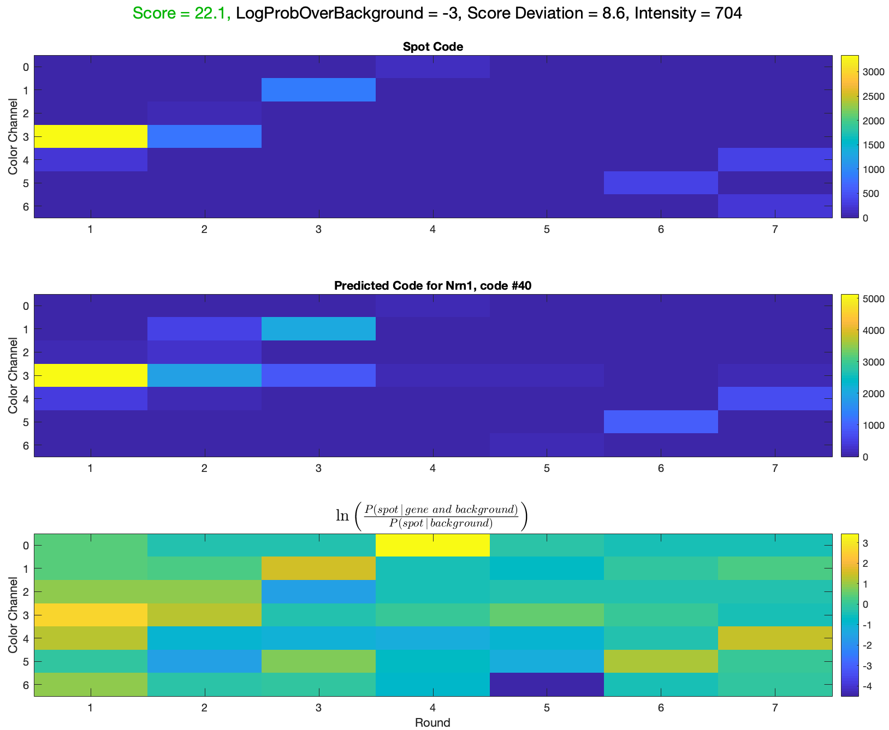
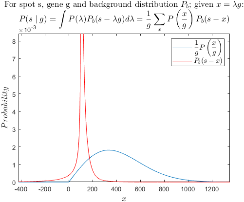
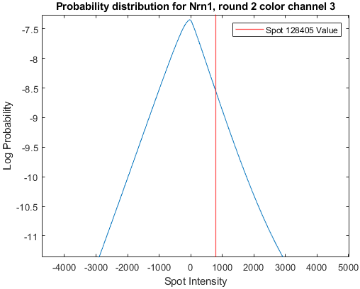

# How to run
The only file that you need to run to obtain and save the data is [bridge_process_template.m](https://github.com/jduffield65/iss/blob/master/bridge_process_template.m). The following will explain the changes to this file that need to made in order for it work with your data.

## Parameters that should be checked before each run
There are a few parameters that need double checking or adjusting before each run:
* [```o.AnchorRound```](https://github.com/jduffield65/iss/blob/b537681136244984efc1182d23f244a7e3dc9caf/bridge_process_template.m#L4): This is the index of the anchor round. Should be the first round after imaging rounds. The anchor round is the round that contains the Dapi image and anchor channel image, which contains spots arising from all genes.
* [```o.AnchorChannel```](https://github.com/jduffield65/iss/blob/b537681136244984efc1182d23f244a7e3dc9caf/bridge_process_template.m#L5): This is the channel (starting from 1) in the anchor round (given by [```o.AnchorRound```](https://github.com/jduffield65/iss/blob/b537681136244984efc1182d23f244a7e3dc9caf/bridge_process_template.m#L4)) which contains the spots. The final genes (in probability and dot product methods) stem from these spots and it is also used for registration.
* [```o.DapiChannel```](https://github.com/jduffield65/iss/blob/b537681136244984efc1182d23f244a7e3dc9caf/bridge_process_template.m#L6): This is the channel in the anchor round that contains the Dapi images.
* [```o.InitialShiftChannel```](https://github.com/jduffield65/iss/blob/b537681136244984efc1182d23f244a7e3dc9caf/bridge_process_template.m#L7): This is the channel used to register all rounds to the anchor, so ensure it is one of the best colour channels. 
* [```o.ReferenceRound```](https://github.com/jduffield65/iss/blob/b537681136244984efc1182d23f244a7e3dc9caf/bridge_process_template.m#L8): This is the index of the reference round. The reference round, is the round that the global coordinate system is built upon and all other rounds are registered to, it can be equal to or different to [```o.AnchorRound```](https://github.com/jduffield65/iss/blob/b537681136244984efc1182d23f244a7e3dc9caf/bridge_process_template.m#L4). If it is not equal to [```o.AnchorRound```](https://github.com/jduffield65/iss/blob/b537681136244984efc1182d23f244a7e3dc9caf/bridge_process_template.m#L4), then the anchor round is not used for anything.
* [```o.ReferenceChannel```](https://github.com/jduffield65/iss/blob/b537681136244984efc1182d23f244a7e3dc9caf/bridge_process_template.m#L9): This is the channel (starting from 1) within the reference round (given by [```o.ReferenceRound```](https://github.com/jduffield65/iss/blob/b537681136244984efc1182d23f244a7e3dc9caf/bridge_process_template.m#L8)) which the global coordinate system is built upon. Ensure it is one of the best colour channels.
* [```o.RawFileExtension```](https://github.com/jduffield65/iss/blob/b537681136244984efc1182d23f244a7e3dc9caf/bridge_process_template.m#L10): This is the format of the raw data in [```o.InputDirectory```](https://github.com/jduffield65/iss/blob/f739d4c2e38c66ff82e7fd7a9f02b0fe73125353/bridge_process_template.m#L13).
* [```o.LogToFile```](https://github.com/jduffield65/iss/blob/5ba65f7c264798e66a91417be886707760062958/bridge_process_template.m#L11): Set this to 1 if you want the contents of the command window output to a .txt file. If you don't want the file, set to 0. By default, it is 1.

## File names
There are a number of file/folder paths which need to be given:
* [```o.InputDirectory```](https://github.com/jduffield65/iss/blob/f739d4c2e38c66ff82e7fd7a9f02b0fe73125353/bridge_process_template.m#L13): This is the path of the folder that contains the raw data, of type specified by [```o.RawFileExtension```](https://github.com/jduffield65/iss/blob/eb6d7c23acf2b59a18903511b25b34ecd756c05b/bridge_process_template.m#L20), e.g. ```.nd2```. An example of what this folder typically looks like is given below:

<p float="left">
 
</p>

* [```o.FileBase```](https://github.com/jduffield65/iss/blob/f739d4c2e38c66ff82e7fd7a9f02b0fe73125353/bridge_process_template.m#L15-L24): These are the names of the files within ```o.InputDirectory``` (minus the extension). For the above example, we would set
<pre>
o.FileBase{1} = 'Exp1_r0';
o.FileBase{2} = 'Exp1_r1';
&#8942
o.FileBase{7} = 'Exp1_r6';
o.FileBase{8} = 'Exp1_anchor';
</pre>
You need to make sure that ```o.FileBase{```[```o.ReferenceRound```](https://github.com/jduffield65/iss/blob/f739d4c2e38c66ff82e7fd7a9f02b0fe73125353/bridge_process_template.m#L8)```}``` is set to the anchor round. Also, the other rounds must be in the correct imaging order.

* [```o.TileDirectory```](https://github.com/jduffield65/iss/blob/f739d4c2e38c66ff82e7fd7a9f02b0fe73125353/bridge_process_template.m#L26): This is the path for the folder that you would like the filtered images for each tile, round and colour channel to be saved to. The file named as  ```o.FileBase{r}_tT.tif``` contains all the colour channel images for round r, tile T.

* [```o.OutputDirectory```](https://github.com/jduffield65/iss/blob/f739d4c2e38c66ff82e7fd7a9f02b0fe73125353/bridge_process_template.m#L27): This is the path for the folder that you would like the iss objects after each step of the pipeline to be saved.

* [```o.CodeFile```](https://github.com/jduffield65/iss/blob/f739d4c2e38c66ff82e7fd7a9f02b0fe73125353/bridge_process_template.m#L30): This is the path for the file containing the code for each gene. The file should be a text file containing two columns, the first being the gene name. The second is the code specifying which colour channel that gene should appear in each round. Thus it is of length [```o.nRounds```](https://github.com/jduffield65/iss/blob/eb6d7c23acf2b59a18903511b25b34ecd756c05b/bridge_process_template.m#L5), containing numbers in the range from 0 to [```o.nBP```](https://github.com/jduffield65/iss/blob/eb6d7c23acf2b59a18903511b25b34ecd756c05b/bridge_process_template.m#L74)-1. An example codebook for ```o.nRounds=o.nBP=7``` is shown below:

<p float="left">
 
</p>

## Running with a subset of tiles
Running the pipeline with the whole set of tiles can be quite time consuming so it is sometimes desirable to run the pipeline on a subset of tiles. You can do this via the [```o.EmptyTiles```](https://github.com/jduffield65/iss/blob/9b863b1ff3589794334479cad0f31ce3db3698e3/%40iss/iss.m#L455-L456) variable. For example, to only use tiles 1 and 2, you can add the [following lines](https://github.com/jduffield65/iss/blob/9b863b1ff3589794334479cad0f31ce3db3698e3/bridge_process_template.m#L62-L65) to [bridge_process_template.m](https://github.com/jduffield65/iss/blob/PixelBased/bridge_process_template.m):

```matlab
o.EmptyTiles(:) = 1;
UseTiles = [1,2];
o.EmptyTiles(UseTiles) = 0;
```

All tiles ```t```, such that ```o.EmptyTiles(t) = 1``` will be skipped. You can add this at any stage of the pipeline, after [```extract_and_filter```](https://github.com/jduffield65/iss/blob/9b863b1ff3589794334479cad0f31ce3db3698e3/bridge_process_template.m#L59). If you add it before the [registration step](https://github.com/jduffield65/iss/blob/9b863b1ff3589794334479cad0f31ce3db3698e3/bridge_process_template.m#L99), then if more than one tile is specified, they should each have at least one neighbour. An example showing three valid entries and one incorrect entry of ```o.EmptyTiles```, for a dataset consisting of 6 tiles is shown below.

:heavy_check_mark: | :heavy_check_mark: |  :heavy_check_mark: | :x:
:------------ | :-------------| :-------------| :-------------
| ```1 1```       | ```0 1```     |   ```0 0```   |  ```0 1```      
| ```0 0```       | ```0 1```     |   ```0 1```   |  ```1 0```      
| ```1 1```       | ```1 1```     |   ```1 1```   |  ```1 1```     
|Tiles 2 and 5 | Tiles 1 and 2 |  Tiles 1,2 and 4 | Tiles 1 and 5

Running the full pipeline (post extract_and_filter) should take on the order of half an hour, if only one tile is selected.

## Stitching and registration parameters
These are parameters that slightly affect how the stitching of tiles and registration between rounds and colour channels works. The default values in [bridge_process_template.m](https://github.com/jduffield65/iss/blob/master/bridge_process_template.m) should work most of the time but there are some cases when they may need altering.

* [```o.RegSearch```](https://github.com/jduffield65/iss/blob/eb6d7c23acf2b59a18903511b25b34ecd756c05b/bridge_process_template.m#L61-L64): The algorithm for stitching together tiles only looks at shifts in the range specified by ```o.RegSearch```. The values that may need changing here are ```o.RegSearch.South.Y``` and ```o.RegSearch.East.X```. The default values of ```-1900:o.RegStep(2):-1700``` are heavily dependent on [```o.TileSz```](https://github.com/jduffield65/iss/blob/eb6d7c23acf2b59a18903511b25b34ecd756c05b/bridge_process_template.m#L44). I.e. we only consider overlaps between 148 - 348 pixels which cover the expected value of about 10% (205 pixels). If the expected overlap or [```o.TileSz```](https://github.com/jduffield65/iss/blob/eb6d7c23acf2b59a18903511b25b34ecd756c05b/bridge_process_template.m#L44) is different to this though, these values will need changing. 

* [```o.FindSpotsSearch```](https://github.com/jduffield65/iss/blob/eb6d7c23acf2b59a18903511b25b34ecd756c05b/bridge_process_template.m#L88-L89): The algorithm for finding shifts between the anchor round and each imaging round only looks at shifts in the range specified by ```o.FindSpotsSearch```. The default values assume a relatively small shift of absolute value less than 100 pixels. However, if you know one round had a particularly large shift, you will need to change this range. You can also specify a different range for each round through:
```matlab
o.FindSpotsSearch = cell(o.nRounds,1);
for r = o.UseRounds
    o.FindSpotsSearch{r}.Y = MinYShift:o.FindSpotsStep(1):MaxYShift;
    o.FindSpotsSearch{r}.X = MinXShift:o.FindSpotsStep(1):MaxXShift;
end
```

## Visualising results
The pipeline runs two different algorithms for assigning genes to spots. The following will give instructions explaining how to view the distribution of assigned genes in both cases.

### Dot product method
To visualise the results, load in the final saved iss object which should be named [```oCallSpots.mat```](https://github.com/jduffield65/iss/blob/eb6d7c23acf2b59a18903511b25b34ecd756c05b/bridge_process_template.m#L111). Then, load in the  background dapi image and run [```o.plot```](https://github.com/jduffield65/iss/blob/eb6d7c23acf2b59a18903511b25b34ecd756c05b/bridge_process_template.m#L116-L117). This will show you the gene assignments (saved as [```o.SpotCodeNo```](https://github.com/jduffield65/iss/blob/59a7583fef8bd0231cbc0182394fcdcff0c84a9c/%40iss/iss.m#L519)) given by the file [```o.call_spots```](https://github.com/jduffield65/iss/blob/eb6d7c23acf2b59a18903511b25b34ecd756c05b/bridge_process_template.m#L109) which is achieved by taking the dot product of the [normalised spot](https://github.com/jduffield65/iss/blob/59a7583fef8bd0231cbc0182394fcdcff0c84a9c/%40iss/iss.m#L552) and [gene codes](https://github.com/jduffield65/iss/blob/59a7583fef8bd0231cbc0182394fcdcff0c84a9c/%40iss/iss.m#L551). Only the results where this dot product (saved as [```o.SpotScore```](https://github.com/jduffield65/iss/blob/59a7583fef8bd0231cbc0182394fcdcff0c84a9c/%40iss/iss.m#L524)) is above [```o.CombiQualThresh```](https://github.com/jduffield65/iss/blob/eb6d7c23acf2b59a18903511b25b34ecd756c05b/bridge_process_template.m#L115) will be shown. An example plot is given below with ```o.CombiQualThresh = 0.7```.

<p float="left">
 
</p>

To change the value of the threshold, simply set ```o.CombiQualThresh = NewValue``` and then run ```iss_change_plot(o)```. The above data with ```o.CombiQualThresh = 0.9``` is shown below:

<p float="left">
 
</p>

With [```o.CallSpotsCodeNorm = 'WholeCode'```](https://github.com/jduffield65/iss/blob/eb6d7c23acf2b59a18903511b25b34ecd756c05b/bridge_process_template.m#L108), each spot and gene code has L2 norm of 1 so the maximum value of the dot product hence ```o.CombiQualThresh``` is 1 (Recommend ```o.CombiQualThresh ~ 0.7```). However, with ```o.CallSpotsCodeNorm = 'Round'```, each round in each code has L2 norm of 1 so each code has L2 norm of [```o.nRounds```](https://github.com/jduffield65/iss/blob/eb6d7c23acf2b59a18903511b25b34ecd756c05b/bridge_process_template.m#L5). So in this case, the max value of the dot product hence ```o.CombiQualThresh``` would be ```o.nRounds``` (Recommend ```o.CombiQualThresh ~ 4``` for ```o.nRounds=7```). Note that if you change ```o.CallSpotsCodeNorm```, then you need to run [```o.call_spots```](https://github.com/jduffield65/iss/blob/eb6d7c23acf2b59a18903511b25b34ecd756c05b/bridge_process_template.m#L109) again. The justification for setting ```o.CallSpotsCodeNorm = 'Round'``` is that with no bleed through, we expect each spot to appear in one colour channel in each round so we want to give each round equal weighting, but with ```o.CallSpotsCodeNorm = 'WholeCode'```, a particularly intense round would dominate the others.

### Probability method
To view the results in this case, start off as before by loading in the Dapi image and running [```o.plot```](https://github.com/jduffield65/iss/blob/eb6d7c23acf2b59a18903511b25b34ecd756c05b/bridge_process_template.m#L116-L117). Then to see the probability gene assignments, run [```iss_change_plot(o,'Prob')```](https://github.com/jduffield65/iss/blob/eb6d7c23acf2b59a18903511b25b34ecd756c05b/bridge_process_template.m#L122). These are the gene assignments (saved as [```o.pSpotCodeNo```](https://github.com/jduffield65/iss/blob/59a7583fef8bd0231cbc0182394fcdcff0c84a9c/%40iss/iss.m#L652)) given by [```o.call_spots_prob```](https://github.com/jduffield65/iss/blob/eb6d7c23acf2b59a18903511b25b34ecd756c05b/bridge_process_template.m#L110)). 

This method works by finding the probability, in each round and channel, that the result of removing a scaled version of the gene code from the spot code can be explained by the background distribution in that round and channel. Then the [total log probability](https://github.com/jduffield65/iss/blob/59a7583fef8bd0231cbc0182394fcdcff0c84a9c/%40iss/iss.m#L642) is found by summing up all ```o.nRounds*o.nBP``` of the log of these probabilities. This is explained further in the section [Understanding the probability method](#understanding-the-probability-method). The score used for this method (saved as [```o.pSpotScore```](https://github.com/jduffield65/iss/blob/59a7583fef8bd0231cbc0182394fcdcff0c84a9c/%40iss/iss.m#L645)) is then the largest log probability minus the second largest i.e. the probability the spot is the gene given by ```o.pSpotCodeNo``` minus the probability that the spot is the next most likely gene. 

Spots for which ```o.pSpotScore>o.pScoreThresh``` or ```o.pSpotIntensity>o.pIntensityThresh``` are then shown. For spot s, [```o.pSpotIntensity(s)```](https://github.com/jduffield65/iss/blob/59a7583fef8bd0231cbc0182394fcdcff0c84a9c/%40iss/iss.m#L639) is the mean spot intensity of the ```o.nRounds``` spot intensities specified by [```o.CharCodes(o.pSpotNo(s))```](https://github.com/jduffield65/iss/blob/59a7583fef8bd0231cbc0182394fcdcff0c84a9c/%40iss/iss.m#L536) minus the mean of all of the other ```o.nRounds*o.nBP-o.nRounds``` spot intensities in the code. This is used as the probability method tends to penalise the score if the intensity of the spot is higher than expected by the gene code. This feature is not desirable, but ```o.pSpotIntensity``` would benefit from such anomalously large intensities but only if they are in the rounds/channels predicted by the gene it was assigned to. The plot for the same data set shown for the dot product method is given below, with ```o.pScoreThresh=10``` and ```o.pIntensityThresh=100``` (I would recommend to use values near these).

<p float="left">
 
</p>

As with the other method, to change the value of the threshold, simply set ```o.pScoreThresh = NewValue``` and  ```o.pIntensityThresh = NewValue```and then run ```iss_change_plot(o)```. The above data with ```o.pScoreThresh = 20``` and ```o.pIntensityThresh = 1000``` is shown below:

<p float="left">
 
</p>

### Which method to use?
The dot product method involves relative normalisation between rounds and colour channels to make them more equal and thus have a more equal contribution to the dot product. However, this sometimes causes the worse colour channels (usually one and three) to be boosted too much, causing false assignments. An example of this is given below (codes and spots are normalised so have L2 norm of 1).

<p float="left">
 
</p>

Here, because round 7, channel 6  is particularly low intensity, when it is normalised it gets boosted resulting in this square dominating the whole code. Then to have a high dot product, this spot must match to a gene which is also high in round 7, channel 6 even though it doesn't match any other squares.

The probability method does not involve any such normalisation so is probably the better method to use. Also, with the recommended threshold values (first plot of each method), much more spots overcome the thresholding than the dot product method (38% more in this example).

### Pixel based results
To view the [results from the pixel based method](https://github.com/jduffield65/iss/blob/849350e6f0a4742d8fd6a3e083b0ffcd81914e31/%40iss/iss.m#L743-L771), run ```iss_change_plot(o,'Pixel')```. In this case, the spots are detected differentely, but the gene assignments are still carried out using the probability method. The thresholds to use are thus: ```o.pScoreThresh``` and ```o.pIntensityThresh```. The results saved have analagous names and meanings as with the probability method, except the prefix is ```px``` instead of ```p``` e.g. ```o.pxSpotScore```.

Also, the pixel based method allows for the possibility of multiple genes assigned to the same pixel. To view these overlapping genes, you can set ```o.pScoreThresh2``` to a value below 0. It has a default value of 0 meaning only genes that are the best match at each pixel can be shown. If you set it to ```o.pScoreThresh2 = -0.001;```, then it allows for spots for which ```o.pxSpotScore = 0``` i.e. the second best match at that pixel.

### Viewing specific genes
To see the distribution of a specific gene or specific set of genes, run ```iss_change_plot(o,CallSpotsMethod,GeneNames)``` with the plot open, where ```CallSpotsMethod``` is ```'Prob'```, ```'DotProduct'``` or ```'Pixel'``` as before. GeneNames is a cell array containing the names of the genes of interest, so to see Plp1 and somatostatin  with the probability method, run ```iss_change_plot(o,'Prob',[{'Plp1'},{'Sst'}])```. The result is shown below.

<p float="left">
 
</p>

The gene names given must exactly match those names in [```o.GeneNames```](https://github.com/jduffield65/iss/blob/2ec0f5fb924c28f76b06d5d9d00bc14f88d4b2ba/%40iss/iss.m#L541) which come from the codebook. To revert to showing all genes, run with ```GeneNames=o.GeneNames``` i.e. ```iss_change_plot(o,'Prob',o.GeneNames)```. To see all genes except for Plp1 and somatostatin, run with ```GeneNames=setdiff(o.GeneNames,[{'Plp1'},{'Sst'}])```

### Viewing specific spots
To see the distribution of a specific set of spots run ```iss_change_plot(o,CallSpotsMethod,GeneNames, SpotSet)``` with the plot open. ```SpotSet``` is logical array and only spots ```s``` for which ```SpotSet(s) = 1``` are shown. This allows you to choose your own thresholding methods, which may differ from the [default ones](https://github.com/jduffield65/iss/blob/PixelBased/@iss/quality_threshold.m). An example dataset for which ```SpotSet = o.pxSpotScore>30 & o.pxSpotIntensity > 500;``` is shown below:

<p float="left">
 
</p>

#### Clustered spots
You can also restrict the display to spots that are clustered, this acts as a guide to where the cell locations are. To do this, run ```SpotSetClustered = get_gene_clusters(o,CallSpotsMethod,r,k,SpotSet)``` followed by ```iss_change_plot(o,CallSpotsMethod,GeneNames, SpotSetClustered)```. A cluster is required to have ```k``` spots from ```SpotSet``` to be within a distance ```r``` pixels of each other. An example with ```CallSpotsMethod = Pixel```, ```r = 7```, ```k = 3``` and ```SpotSet = o.pxSpotScore>30 & o.pxSpotIntensity > 500;``` is shown below:

<p float="left">
 
</p>

By default (running ```get_gene_clusters(o,'Pixel')```), ```r = 18```, ```k = 20``` and ```SpotSet = o.quality_threshold(CallSpotsMethod)```. This is shown below for the pixel based method:

<p float="left">
 
</p>

### Visualising individual spots
To view the dot product assignment of a particular gene, with the plot open, run [```iss_view_codes(o,234321,Norm)```](https://github.com/jduffield65/iss/blob/eb6d7c23acf2b59a18903511b25b34ecd756c05b/bridge_process_template.m#L119). This will cause a crosshair to appear on the plot, then just click on the spot of interest as shown below.

<p float="left">
 
</p>

234321 is just the figure number of the plot (should always be the same). Norm controls the normalisation applied to the spot and gene codes. You can set Norm equal to 1,2 or 3 to highlight certain features:
* Norm = 1: This gives the raw values. For the spot in the previous section, this would be:

<p float="left">
 
</p>

* Norm = 2: This normalises in the same way used in ```call_spots``` i.e. it [normalises by the percentile](https://github.com/jduffield65/iss/blob/3f0ec254b1bd71b1c4b15ebcf9b319e3fd82f70d/%40iss/call_spots.m#L42) given by [```o.SpotNormPrctile```](https://github.com/jduffield65/iss/blob/59a7583fef8bd0231cbc0182394fcdcff0c84a9c/%40iss/iss.m#L267) in each colour channel and round and then depending on ```o.CallSpotsCodeNorm```, it [normalises the resultant so the either the whole code has L2 norm of 1 or each round does](https://github.com/jduffield65/iss/blob/3f0ec254b1bd71b1c4b15ebcf9b319e3fd82f70d/%40iss/call_spots.m#L163-L187). The plot in the previous section used Norm = 2.

* Norm = 3: This normalises [each colour channel by the percentile given by ```o.SpotNormPrctile```  across all rounds](https://github.com/jduffield65/iss/blob/3f0ec254b1bd71b1c4b15ebcf9b319e3fd82f70d/iss_view_prob.m#L41-L49). Using this, the spot we are considering would appear like this:

<p float="left">
 
</p>

Also, if you know the index (```SpotNo```) of the spot you are interested in but don't want to find it in the plot, you can just run ```iss_view_codes(o,234321,Norm,SpotNo)```.

The equivalent function for the probability method is [```iss_view_prob(o,234321,Norm,CallSpotsMethod)```](https://github.com/jduffield65/iss/blob/eb6d7c23acf2b59a18903511b25b34ecd756c05b/bridge_process_template.m#L123) which is called in exactly the same way, only can specify whether ```CallSpotsMethod``` is ```'Prob'``` or ```'Pixel'```. If this is not specified, it will default to the method used in the plot currently open. The figure is the same except the gene shown is that given by ```o.pSpotCodeNo``` or  ```o.pxSpotCodeNo``` not ```o.SpotCodeNo```. Also, there is an extra plot which shows you how the overall probability is made up from the individual probabilities of each round and channel, relative to the probability that the spot can be explained by the background alone (without any genes). This plot for the example spot is given below:

<p float="left">
 
</p>

The plot also gives the spot score, log probability over background, score deviation and intensity values for its assignment. Log probability over background is the total probability relative to the probability given by just the background distribution i.e. sum of all squares in bottom plot. Score deviation is the standard deviation of the log probabilities for assigning the spot to every gene in the codebook. This is included as if ```o.pSpotScoreDev+o.pSpotScore<o.pDevThresh```, then the assignment is rejected. This is to get rid of spots that have a similar probability when matched to every gene. Also, the values of these variables are coloured - green means that value caused the gene to be automatically accepted, red means that that value caused the gene to fail (green supersedes red most of the time). If all variables are black, then the match is also accepted.

### Understanding the probability method
If you left/right click on a particular square in the bottom plot of the ```iss_view_prob``` window, the plot on the left/right below will appear, further explaining the probability for that particular round and channel. These particular plots are for round 7, channel 2 for the above example spot. These are the absolute probabilities (i.e. without subtracting the probability due to background alone).

<p float="left">
 

</p>

The left plot shows how the probability for the round/channel that was clicked varies with spot intensity. The red line is the intensity for the spot considered, so where this intersects the blue curve indicates the absolute probability of the square that was clicked (-3.284 here). This then basically tells you how well the assign gene (blue curve) explains the spot intensity (red line) in this particular round/channel, the closer the red line is to the peak of the blue curve, the better.

The right plot reveals a bit more about what is happening behind the curtain. It shows the underlying probability distributions that lead to the final probability. The probability that we are trying to maximise is the probability that the spot, , can be explained by the gene, : .

The equation 


is saying that the probability of matching spot  to gene  is equal to the probability that the intensity of  once the intensity of the gene scaled by  has been removed can be explained by the background . This is then weighted by the probability of that scaling,  and then summed over all possible scalings, .

The probability distribution of  is different depending whether the particular round/channel, , appears in ```o.CharCodes(g)``` or not, for each gene, there is one such colour channel for each round so ```o.nRounds``` incidences in total. We call this set , it is different for each gene . For  not in , we expect the spot not to appear so the probability is peaked at . The actual distribution we use is ( is a constant):


The round 7, channel 2 example shown, corresponds to this set, so the blue curve on the right follows this distribution.

On the other hand, for  that are in , we do expect the spot to appear and thus the scaling of the gene cannot be 0 or negative. We use the rayleigh distribution, which is such that  and also the probability stays near the peak level for quite a large range of  which is desirable as to not penalise spot intensities that are higher than expected too much. The actual distribution we use is ( is a constant):


For the example spot, ```[round 2, colour channel 2]``` is in the set  and the plots are shown below:

<p float="left">
 

</p>

The constants  and  are [```o.ExpConst```](https://github.com/jduffield65/iss/blob/d8dc313f1a50d47a1df386098bcea2811f09dbf6/%40iss/iss.m#L607) and [```o.RaylConst```](https://github.com/jduffield65/iss/blob/d8dc313f1a50d47a1df386098bcea2811f09dbf6/%40iss/iss.m#L603) respectively. The default values were chosen so the mean values of the probability distributions matched the mean values of  in a particular data set.

The red curve on the right plot represents the background distribution which is just the [histogram of the raw data after the initial filtering](https://github.com/jduffield65/iss/blob/ffcffdaa492369e14ea4cfef214025e84e1becdf/%40iss/extract_and_filter.m#L152). This tends to be strongly peaked where the spot intensity is equal to the scaled intensity. Because the histogram only takes discrete integer values, we need to turn the integral into a sum, and also making the substitution , we get (The  factor clearly blows up for  so we also normalise  so it has a sum of 1 over all ):


Thus, from this right hand plot, to get the absolute probability of the clicked upon square, we need to multiply the two curves together and then sum the resultant over all x. This means the degree of overlap determines the probability, the greater the overlap the better. For example, looking at the ```[round 7, colour channel 2]``` case, the only way the log probability can get closer to the peak in the left hand plot is by the spot intensity reducing a little. The effect of this on the right hand plot would be to shift the red curve to the left which clearly increases the degree of overlap with the blue curve. Both the rounds/channels considered so far show pretty good overlap, an example with considerably worse overlap is ```[round 7, colour channel 3]``` shown below:

<p float="left">
 

</p>

This example also exhibts a potential pitfall of the method in dealing with bleedthrough. ```[round 2, colour channel 3]``` is not in
 for Nrn1 so we assume  is most likely to be 0, this means for a spot to match to Nrn1, we would expect that spot to have intensity of zero in ```[round 2, colour channel 3]```. But looking at the predicted code for Nrn1, the gene intensity in ```[round 2, colour channel 3]``` is 1891, so why would be possibly expect the spot to have zero intensity? This seems to throw away information, we have learned about the bleedthrough between colour channel 2 and 3. The Bleedthrough does have some effect though. Because of the  factor, the  curve is flattened out. This reduces the peak probability and the magnitude of the gradient (to get from the peak log probability to the peak probability - 1 for ```[round 2, colour channel 3]``` would require a change in spot intensity of around 700 whereas in ```[round 7, colour channel 2]``` where there is no bleedthrough, this would require a change of 8). From this we see that the probability of rounds/channels with high bleedthrough are insensitive to spot intensity but have a low probability (although with bleedthrough, the background distribution tends to have a wider peak which helps nullify the reduction in peak probability - the wider the background distribution peak, the more overlap with the wide  caused by bleedthrough, thus the higher the max probability). To counteract this, we could add these rounds/channels with high bleedthrough to , but this would make the size of  vary between genes which may introduce a subtelty when comparing the probabilities of assigning to genes, i.e. an artificial spot with high postive intensity in all rounds/channels would preferentially match with genes for which the size of  is larger.

### Visualising filtering step
The tiles are filtered in the [```extract_and_filter``` step](https://github.com/jduffield65/iss/blob/34786306a0ee42fcea10188b7c5c688362eb20b6/%40iss/extract_and_filter.m#L230-L239). The goal of this step is to emphasize the spots over the background. To see if it has worked as intended or if the filtering parameters are correct, you can run [```view_filtering(o,r,t)```](https://github.com/jduffield65/iss/blob/PixelBased/view_filtering.m); r is the round of interest and t is the tile of interest. You can run this before the tiles have been produced, the only requirement is that the ```o``` object must have the following properties specified:
* ```o.InputDirectory```
* ```o.FileBase```
* ```o.RawFileExtension```
* ```o.AnchorRound```
* ```o.AnchorChannel```
* ```o.DapiChannel```
* ```o.TileSz```

The first image that will appear is the raw image for the first colour channel. You can use the horizontal scroll bar to change colour channel, e.g. an example anchor image is shown below on the left. You can then press the Filter button to see the filtered image (i.e. what the files in ```o.TileDirectory``` will end up looking like).

<p float="left">
 
 
</p>

With the filter button pressed, you can change the radius of the filter used with the vertical slider and the plot should update automatically. The default value is the value of ```o.ExtractR1``` that would be used in the pipeline automatically. If you decide that another value is more suitable, you can just run in the command window: ```o.ExtractR1 = NewValue;```. The plots below show the same region that is unfiltered, filtered with filter radius of 3 (default) and 8 respectively.

<p float="left">
 
 
 
</p>


If you are viewing the Dapi colour channel in the Anchor round, then the vertical slider controls ```o.DapiR``` instead and the [filtering is different](https://github.com/jduffield65/iss/blob/34786306a0ee42fcea10188b7c5c688362eb20b6/%40iss/extract_and_filter.m#L233-L234). 

